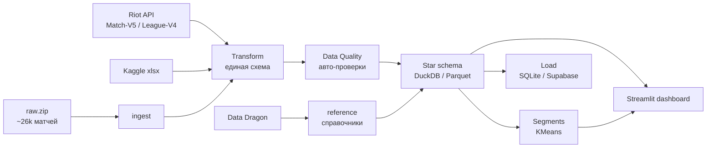
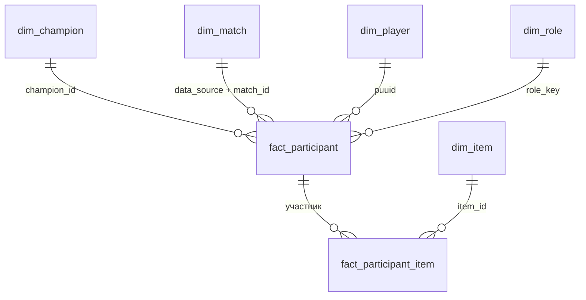

# 🎮 LoL Analytics — аналитическая платформа по League of Legends

Учебный проект по дата-инженерии и аналитике: полный путь данных от сбора через
**Riot API** и большого датасета до интерактивного дашборда на **Streamlit** —
с звёздной схемой, статистической строгостью и живым деплоем.

> **🔴 Живой дашборд:** **https://lol-analytics-asvnevc2yjcwphjea7dyru.streamlit.app/**

---

## Чем выделяется

- **Три источника вместе, а не один.** Собственная свежая выборка (Riot API),
  большой архив `riot_full` (~26k матчей, 7 патчей) и Kaggle — приведены к единой
  схеме и сравниваются через поле `data_source` (не смешиваются вслепую).
- **Статистическая строгость, а не «голый winrate»:**
  - **интервал Уилсона** для силы чемпионов — высокий winrate на малой выборке
    считается шумом, а не силой;
  - **z-тест долей** в сравнении патчей — баф/нерф отличается от случайности;
  - **KMeans-сегментация** игроков по стилю (архетипы).
- **Настоящий ETL:** оркестратор со стадиями (`main.py`), слой контроля качества
  с кодами возврата, звёздная схема с мостом предметов, загрузка в БД.
- **Живой деплой** на Streamlit Cloud (дашборд читает Parquet напрямую через DuckDB).

## Архитектура пайплайна



Всё управляется одним оркестратором (`main.py`, `argparse`); прогон логируется в `etl.log`.

| Стадия | Скрипт | Что делает |
|:--|:--|:--|
| `reference` | `fetch_reference.py` | справочники чемпионов/предметов из Data Dragon |
| `ingest` | `ingest_riot_full.py` | разбор архива `raw.zip` (~26k матчей, патчи 16.7–16.12) |
| `extract` | `riot_data_collector.py` | инкрементальный сбор через Riot API (retry, rate-limit, дедуп по логу) |
| `transform` | `build_common_analytics_layer.py` | источники → единая схема, фильтр ранкед-соло (`queue_id=420`), Parquet |
| `quality` | `run_data_quality.py` | серия авто-проверок (10 игроков в матче, winrate ≈ 0.5, нет дублей/отрицательных метрик…), падает с ненулевым кодом |
| `star` | `build_star_schema.py` | звёздная схема на DuckDB (факт + измерения + витрины) |
| `segments` | `build_player_segments.py` | витрина архетипов игроков (KMeans) |
| `load` | `load_to_warehouse.py` | звезда в SQLite (локально) или PostgreSQL/Supabase (`DATABASE_URL`) |

## Звёздная схема



Факт `fact_participant` (1 строка = игрок в матче) + измерения
`dim_champion / dim_match / dim_player / dim_role`, мост «многие-ко-многим»
`fact_participant_item` → `dim_item`. Витрины: `item_stats`,
`champion_strength` (интервалы Уилсона), `champion_by_duration`, `player_segments`.

## Дашборд (вкладки)

- **Обзор** — KPI (матчи, игроки, чемпионы), авто-инсайты и победители vs проигравшие.
- **Чемпионы** — топ по winrate с поправкой на размер выборки (**нижняя граница Уилсона**), подсветка значимых аномалий меты.
- **Предметы** — «Покупки × Winrate»: какие предметы популярны *и* эффективны.
- **Игроки** — профиль: Riot ID, метрики (KDA, CS / урон / золото / vision в минуту), любимые чемпионы и роли.
- **⏱ Длительность** — «скейлящиеся» чемпионы: разница winrate в длинных и коротких играх.
- **📊 Мета** — сравнение патчей с **проверкой статзначимости** (z-тест долей): баф/нерф отделён от шума.
- **🧩 Архетипы** — сегментация игроков (KMeans) по стилю: кэрри, саппорт, командный игрок… (с профилем каждого сегмента).
- **✅ Качество** — живые проверки данных прямо в UI (участников на матч, дубли, сироты, баланс winrate).

## Запуск

```bash
pip install -r requirements.txt          # зависимости дашборда

# сборка данных локально (пайплайн)
python main.py transform                 # нормализация источников
python main.py quality                   # проверки качества
python main.py star                      # звёздная схема
python main.py all                       # всё сразу: transform → quality → star → segments → load

# витрина архетипов (KMeans) — нужен scikit-learn
pip install -r requirements-build.txt
python main.py segments

# дашборд
streamlit run streamlit_app.py
```

Свежий сбор через API: `python main.py extract --tier master --max-players 10 --matches-per-player 5`
(нужен ключ Riot в переменной окружения `RIOT_API_KEY`).

## Структура

```
main.py                     оркестратор (стадии ETL)
streamlit_app.py            дашборд (читает Parquet через DuckDB)
scripts/                    стадии пайплайна
src/lol_utils/              общий код: config, логирование, метрики, пути
outputs/sql/star/*.parquet  звёздная схема + витрины (данные для дашборда)
data/reference/*.csv        справочники Data Dragon
requirements.txt            зависимости дашборда (рантайм)
requirements-build.txt      зависимости сборки (ETL + scikit-learn)
```

## Стек

`Python` · `pandas` · `DuckDB` · `Parquet` · `scikit-learn` · `SQLAlchemy` ·
`Supabase / PostgreSQL` · `Streamlit` · `Altair`
Источники: **Riot API** (Match-V5, League-V4), **Data Dragon** (справочники), **Kaggle**.

## Заметки по данным и методике

- Анализ ограничен ранкед-соло (`queue_id=420`), чтобы роли и метрики были сопоставимы.
- Tier-list строится по нижней границе интервала Уилсона: высокий winrate на малой
  выборке — это шум, а не сила.
- Источники не смешиваются вслепую — сравниваются через `data_source`; основной
  объём даёт `riot_full` (~26k матчей, патчи 16.7–16.12).
- Архетипы игроков — **сегменты, найденные кластеризацией** (не официальные классы
  Riot); официальные классы у Riot есть только для чемпионов (Fighter / Tank / Mage /
  Assassin / Marksman / Support).
