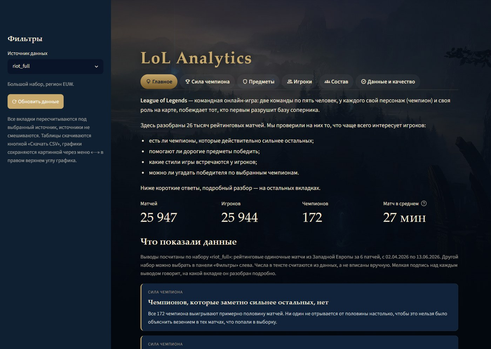
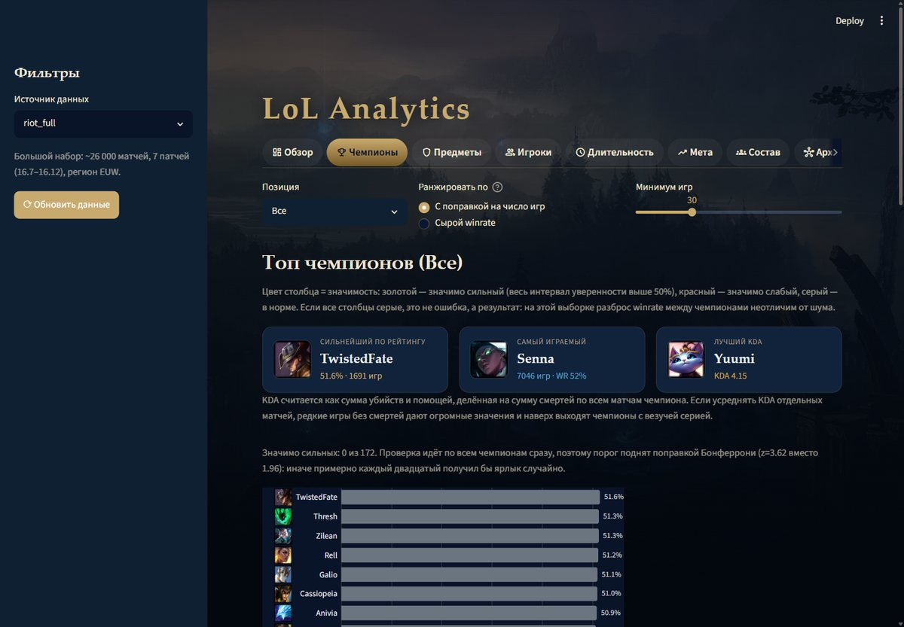
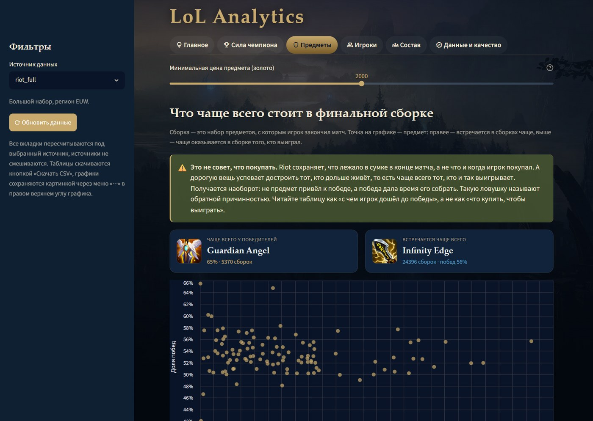
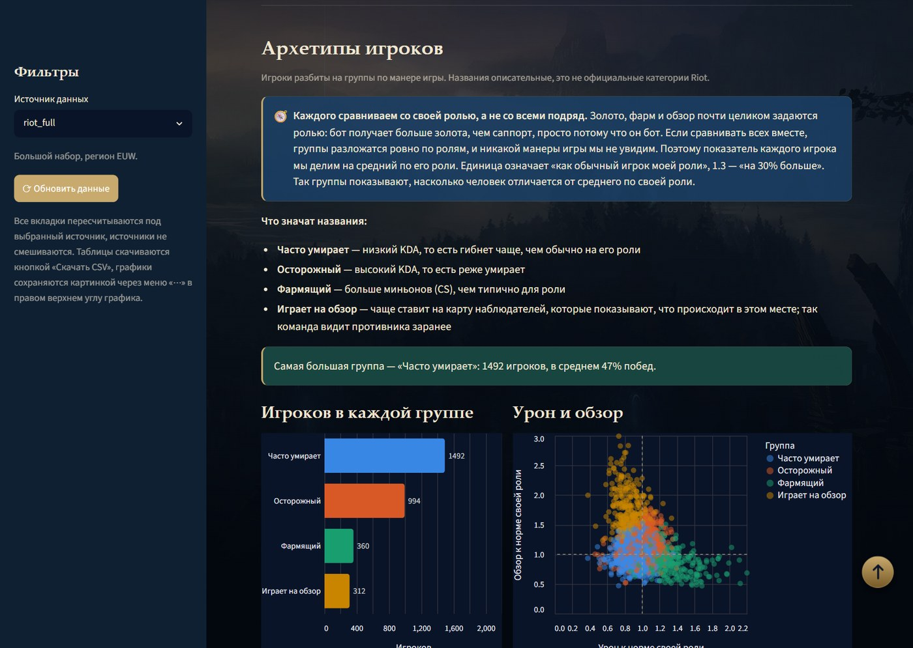
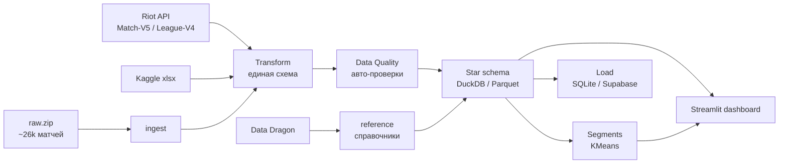
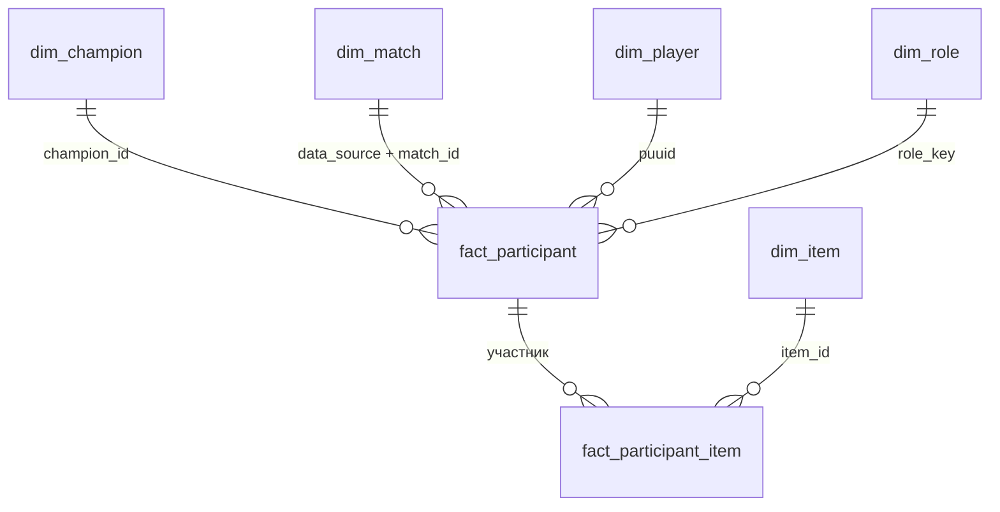

# 🎮 LoL Analytics — аналитическая платформа по League of Legends

[](https://github.com/AnastasiaPatrusheva/lol-analytics/actions/workflows/ci.yml)

Портфолио-проект по дата-инженерии и аналитике: полный путь данных — от сбора
(**Riot API** + большой архив матчей) до интерактивного дашборда на **Streamlit**,
со звёздной схемой, статистической строгостью и живым деплоем.

> **🔴 Живой дашборд:** **https://lol-analytics-asvnevc2yjcwphjea7dyru.streamlit.app/**
>
> **📖 Руководство пользователя:** [docs/РУКОВОДСТВО.md](docs/РУКОВОДСТВО.md) — источники, вкладки и словарь метрик.

|  |  |
|:--|:--|
|  |  |
| **Главное** — выводы с числами, а не витрина лидеров | **Сила чемпиона** — одна проверка в разных разрезах: в общем срезе значимых нет, внутри роли появляются |
|  |  |
| **Предметы** — с явной оговоркой про выживший-байес | **Игроки** — архетипы KMeans по метрикам, нормированным на роль |

---

## Чем выделяется

- **Три источника вместе, а не один.** Собственная свежая выборка (Riot API),
  большой архив `riot_full` (~26k матчей, 7 патчей) и Kaggle — приведены к единой
  схеме и сравниваются через поле `data_source` (не смешиваются вслепую).
- **Статистическая строгость, а не «голый winrate»:**
  - **интервал Уилсона** для силы чемпионов — высокий winrate на малой выборке
    считается шумом, а не силой;
  - **поправка Бонферрони** на множественные сравнения — вердикт «значимо сильный»
    выносится сразу по 172 чемпионам, и без поправки каждый двадцатый получал бы
    ярлык случайно;
  - **z-тест долей** в сравнении патчей — баф/нерф отличается от случайности;
  - **KMeans-сегментация** игроков по стилю, с нормировкой метрик на роль:
    иначе кластеризация находит просто роли и выдаёт их за стили игры.
- **Честность там, где данные не выдерживают выводов.** Winrate предметов — это
  выживший-байес (Riot отдаёт инвентарь на конец матча, а не покупки), и вкладка
  прямо об этом говорит, вместо того чтобы советовать «что собирать».
- **Настоящий ETL:** оркестратор со стадиями (`main.py`), слой контроля качества
  с кодами возврата, звёздная схема с мостом предметов, загрузка в БД.
- **SQL-аналитика в дашборде:** оконные функции (`RANK()`, `AVG() OVER (PARTITION BY …)`)
  для рейтинга чемпионов и отклонения от среднего по классу; прогноз winrate собранного
  состава по историческим долям побед в ролях.
- **Живой деплой** на Streamlit Cloud (дашборд читает Parquet напрямую через DuckDB).

## Что показали данные

Выводы по основному источнику `riot_full`: 25 947 матчей ранкед-соло, патчи 16.7–16.12,
регион EUW. Все цифры воспроизводятся вкладками дашборда.

**1. Ни один чемпион не сильнее 50% — если считать честно.**
Проверка «отличается ли winrate от 50%» идёт сразу по 172 чемпионам. Без поправки на
множественные сравнения значимо сильными выглядели 14 из них — но при истинных 50% у всех
примерно столько и получилось бы случайно. С поправкой Бонферрони (z = 3.62 вместо 1.96)
значимых не остаётся ни одного: на выборке в 26 тысяч матчей разброс winrate между
чемпионами неотличим от шума. Лидер по осторожной оценке, TwistedFate, даёт 53.9% на
1691 игре, и его интервал всё равно накрывает 50%.

**2. Роль объясняет больше, чем чемпион.**
У Shaco winrate различается на 14 процентных пунктов между двумя ролями: 38.3% против 52.2%
при 1515 играх. У Nasus разрыв 10 пунктов. Общий winrate чемпиона без разреза по роли
смешивает две разные игры в одну цифру, поэтому рейтинг чемпионов в дашборде пересчитывается
внутри выбранной позиции, а не фильтруется после.

**3. Длительность матча решает исход сильнее, чем выбор чемпиона.**
Kayle выигрывает 41.6% коротких матчей и 68.3% длинных: разрыв 26.7 пункта, больше, чем
разница между лучшим и худшим чемпионом в рейтинге. У Ornn и Nasus картина та же, у Yorick
и Shen обратная. Важная оговорка: длительность это не фактор, а следствие. Разгромные матчи
заканчиваются быстро, поэтому поражения «скейлеров» механически попадают в короткий бакет.

**4. Winrate предметов почти целиком объясняется выживанием, а не силой предмета.**
Guardian Angel показывает 64.7% побед на 5370 сборках. Riot отдаёт инвентарь на конец матча,
а не покупки: победители дольше живут и успевают достроить дорогое. Ни один предмет не даёт
+15 пунктов к победе. Поэтому вкладка «Предметы» переименована из «что покупать» в «что
обычно стоит в сборке у победителей», а колонка называется «Сборок», а не «Покупок».

**5. Одних чемпионов мало, чтобы угадать победителя: сторона карты значит больше.**
Модель «Состав» обучена на всех патчах, кроме последнего, и проверена на 6743 матчах
патча 16.12, которых не видела. Сначала прогноз сравнивался с 50%, и 52.5% угаданных
матчей выглядели как сигнал. Но стороны карты не равны: в этой выборке красные выигрывают
54.6% матчей (в патче 16.12 — 54.1%), и правило «всегда красные» без единого чемпиона
угадывает больше, чем прогноз. Чемпионы при этом влияют: синие выигрывают 48.3%, когда
по оценке их чемпионы сильнее, и 43.5%, когда слабее (разница 4.8 пункта на ~3300 матчей
в каждой группе). Перекос сторон не ошибка обработки — он есть в исходном JSON Riot, — но
обычно в соло-очереди чуть чаще выигрывают синие, и причину по этим данным установить
не удалось. Проверка заодно исправила формулу: взвешивание по числу игр оказалось худшим
вариантом (51.9%), а нижняя граница Уилсона занижала прогноз на 3.8 пункта, поэтому
вкладка перешла на точечный winrate с равными весами ролей.

**6. Осторожность окупается лучше агрессии.**
После нормировки метрик на среднее по роли игроки делятся на четыре группы. Сегмент с
высоким KDA выигрывает 54.8% матчей, сегмент с низким — 47.1%. Разрыв 7.7 пункта, но он
смешан с уровнем игрока, а не только со стилем: границы групп размыты, силуэт около 0.22.

Оговорка ко всему разделу: выборка смещена в сторону высоких рангов, поэтому выводы
описывают верхнюю часть ладдера, а не среднего игрока.

## Архитектура пайплайна



Всё управляется одним оркестратором (`main.py`, `argparse`); прогон логируется в `etl.log`.

| Стадия | Скрипт | Что делает |
|:--|:--|:--|
| `reference` | `fetch_reference.py` | справочники чемпионов/предметов из Data Dragon |
| `ingest` | `ingest_riot_full.py` | разбор архива `raw.zip` (~26k матчей, патчи 16.7–16.12) |
| `extract` | `riot_data_collector.py` | инкрементальный сбор через Riot API (retry, rate-limit, дедуп по логу) |
| `transform` | `build_common_analytics_layer.py` | источники → единая схема, фильтр ранкед-соло (`queue_id=420`), Parquet |
| `quality` | `run_data_quality.py` | 16 авто-проверок (10 игроков в матче, winrate ≈ 0.5, дубли, ссылочная целостность со справочником, доля ремейков, свежесть данных), падает с ненулевым кодом |
| `star` | `build_star_schema.py` | звёздная схема на DuckDB (факт + измерения + витрины) |
| `segments` | `build_player_segments.py` | витрина архетипов игроков (KMeans) |
| `backtest` | `build_composition_backtest.py` | проверка модели «Состав» на реальных командах: обучение на прошлых патчах, проверка на последнем |
| `load` | `load_to_warehouse.py` | звезда в SQLite (локально) или PostgreSQL/Supabase (`DATABASE_URL`) |

## Звёздная схема



Факт `fact_participant` (1 строка = игрок в матче) + измерения
`dim_champion / dim_match / dim_player / dim_role`, мост «многие-ко-многим»
`fact_participant_item` → `dim_item`. Витрины: `item_stats`,
`champion_strength` (интервалы Уилсона), `champion_by_duration`, `player_segments`.

## Дашборд (вкладки)

Шесть вкладок, каждая отвечает на один вопрос. Порядок — от вывода к разбору,
от общего к частному, в конце основания, на которых всё держится.

| Вкладка | Что показывает |
|:--|:--|
| **💡 Главное** | ключевые цифры и пять выводов с числами, каждый со ссылкой на вкладку, где его можно перепроверить |
| **🏆 Сила чемпиона** | один вопрос «отличается ли winrate от 50%» при разных условиях: роль, патч, длина матча. Рейтинг по **нижней границе Уилсона**, вердикт с **поправкой Бонферрони**, отклонение от среднего по классу (**оконные функции SQL**), сравнение патчей z-тестом, scatter «убийства vs смерти» |
| **🛡️ Предметы** | что чаще всего оказывается в финальной сборке победителя (с оговоркой про выживший-байес) |
| **👥 Игроки** | популяция целиком (распределение LP, архетипы KMeans с нормировкой на роль) и карточка отдельного игрока |
| **⚔️ Состав** | подбор пятёрки по ролям с прогнозом ожидаемого winrate, **проверкой прогноза на реальных матчах** (разделение по патчам, точность / ROC AUC / калибровка) и профилями ролей на радарах |
| **✅ Данные и качество** | отчёт 16 проверок пайплайна, живые проверки витрин, описание выборки, словарь метрик и список ограничений |

Раньше вкладок было десять. «Чемпионы», «Мета» и «Длительность» считали одно и то же —
winrate чемпиона при некотором условии — но проверяли значимость тремя разными способами
(Уилсон с поправкой, z-тест без поправки, вообще без теста). После слияния метод один на
все срезы, и заодно стало видно главное: сила чемпиона проступает только внутри роли и
патча, а в общей таблице усредняется в ноль.

## Словарь метрик

| Метрика | Что означает |
|:--|:--|
| **Winrate** | доля побед |
| **Winrate с поправкой на число игр** | не «сырой» процент побед, а намеренно заниженная (осторожная) оценка с учётом числа игр — **нижняя граница интервала Уилсона**, то есть нижний край диапазона, где реально может лежать истинный winrate. Чем меньше игр, тем шире диапазон и сильнее занижение: 70% на 5 играх (скорее везение) опускаются ниже стабильных 54% на 800 играх. По этой метрике строится рейтинг, чтобы наверх попадали действительно сильные, а не случайные лидеры малой выборки |
| **KDA** | (убийства + помощи) ÷ смерти — общая эффективность в схватках |
| **… в минуту** (CS, урон, золото, обзор) | значение, делённое на длину матча: так сравнимы игроки из коротких и длинных игр |
| **p-значение** | насколько вероятно, что различие случайно; p < 0.05 — вряд ли случайность, изменение реально |
| **Аномалия меты** | чемпион, чей winrate статистически значимо отличается от 50% |
| **Архетип** | группа игроков со схожим стилем (кластеризация), не официальная категория Riot |

## Запуск

Дашборд работает сразу после клонирования: готовые витрины (`outputs/sql/star/*.parquet`)
лежат в репозитории, внешняя БД и ключи не нужны.

```bash
pip install -r requirements.txt          # зависимости дашборда
streamlit run streamlit_app.py           # открыть дашборд
```

Пересборка данных — отдельный сценарий. Сырьё (архив `raw.zip`, выгрузка Riot API,
Kaggle-xlsx) в репозиторий не входит, поэтому у постороннего стадии `transform` и
`ingest` просто сообщат, каких источников нет, и не станут ничего собирать.

```bash
pip install -r requirements-build.txt    # зависимости сборки (+ scikit-learn, pytest)

python main.py transform                 # нормализация источников
python main.py quality                   # проверки качества
python main.py star                      # звёздная схема
python main.py segments                  # витрина архетипов (KMeans)
python main.py backtest                  # проверка модели «Состав»
python main.py all                       # всё сразу: transform → quality → star → segments → load
```

## Обновление данных (свежая выборка через API)

Сбор через Riot API — **локальная ручная операция** (на живом дашборде API не
вызывается: он читает готовый снимок Parquet). Нужен dev-ключ Riot — действует ~24 ч,
берётся на developer.riotgames.com.

```bash
# 1) ключ Riot в текущую сессию терминала (PowerShell):
$env:RIOT_API_KEY = "RGAPI-..."

# 2) одна команда: extract -> transform -> quality -> star
python main.py refresh --tier master --max-players 10 --matches-per-player 5
```

Стадия `refresh` сама прогоняет сбор из API, приведение к общей схеме, проверки
качества и пересборку звёздной схемы (`outputs/sql/star/*.parquet`). Стадии можно
запускать и по отдельности (`python main.py extract` / `transform` / `quality` / `star`).

Чтобы свежие данные попали на **живой дашборд**, закоммитьте обновлённые
`outputs/sql/star/*.parquet` в репозиторий и запушьте — Streamlit Cloud пересоберётся
автоматически.

## Структура

```
main.py                     оркестратор (стадии ETL)
streamlit_app.py            дашборд — точка входа (тонкая)
dashboard/                  модули дашборда: data, stats, tabs/ (по вкладке на файл)
scripts/                    стадии пайплайна
src/lol_utils/              общий код: config, логирование, метрики, пути
outputs/sql/star/*.parquet  звёздная схема + витрины (данные для дашборда)
data/reference/*.csv        справочники Data Dragon
tests/                      юнит-тесты (pytest)
requirements.txt            зависимости дашборда (рантайм)
requirements-build.txt      зависимости сборки (ETL + scikit-learn)
```

## Тесты

```bash
pip install -r requirements-build.txt
pytest tests/
```

Юнит-тесты на ключевые функции: производные метрики (`add_metrics`), разбор матча
(`flatten_match`), нормализация id, интервал Уилсона и поправка Бонферрони, ярлыки
архетипов, геометрия радаров. Тесты Уилсона импортируют макросы из `lol_utils.sql` —
из того же модуля, что использует сборка витрин и дашборд, а не из копии формулы.

**CI:** тесты гоняются автоматически на каждый push и pull request в `main` через
GitHub Actions ([`.github/workflows/ci.yml`](.github/workflows/ci.yml)); есть и ручной
запуск (workflow_dispatch). Живого обновления данных по расписанию нет намеренно:
dev-ключ Riot живёт ~24 ч, для cron-пайплайна нужен постоянный product-ключ.

## Docker

Запуск дашборда в контейнере:

```bash
docker compose up        # соберёт образ и поднимет дашборд на http://localhost:8501
```

`Dockerfile` кладёт в образ дашборд, пакет `dashboard/` и готовые Parquet-витрины —
внешняя БД не нужна.

## Стек

`Python` · `pandas` · `DuckDB` · `Parquet` · `scikit-learn` · `SQLAlchemy` ·
`Supabase / PostgreSQL` · `Streamlit` · `Altair`
Источники: **Riot API** (Match-V5, League-V4), **Data Dragon** (справочники), **Kaggle**.

## Заметки по данным и методике

- Анализ ограничен ранкед-соло (`queue_id=420`), чтобы роли и метрики были сопоставимы.
- **Ремейки отфильтрованы:** матчи короче 5 минут отменены на 3-й минуте из-за выхода
  игрока и не отражают игру. Это 1.3% строк; без фильтра они портили статистику по
  длительности, попадая в бакет «короткие матчи».
- **PUUID в витринах хеширован.** PUUID — постоянный идентификатор аккаунта Riot,
  и публиковать его в открытом репозитории нельзя. В `dim_player` и `fact_participant`
  лежит устойчивый хеш: джойны работают, а идентификатор не раскрывается.
- **KDA считается пулированно** ((убийства + помощи) / смерти по всем матчам), а не
  средним от KDA отдельных матчей: среднее отношений завышает результат в полтора раза
  (3.70 против 2.46) и выводит наверх тех, у кого была серия игр без смертей.
- Tier-list строится по нижней границе интервала Уилсона: высокий winrate на малой
  выборке — это шум, а не сила.
- Источники не смешиваются вслепую — сравниваются через `data_source`; основной
  объём даёт `riot_full` (~26k матчей, патчи 16.7–16.12).
- Большой архив `raw.zip` (~436 МБ, в репозиторий не входит) — набор Parquet-чанков,
  где каждый матч хранится сырым JSON формата Match-V5 (`match_id`, `_raw_json`);
  распаковывается в `data/riot_full/` и разбирается стадией `ingest`.
- Архетипы игроков — **сегменты, найденные кластеризацией** (не официальные классы
  Riot); официальные классы у Riot есть только для чемпионов (Fighter / Tank / Mage /
  Assassin / Marksman / Support). Метрики нормированы на среднее по основной роли
  игрока, иначе KMeans находит просто роли: у бота ~490 золота в минуту против ~315
  у саппорта. Силуэт около 0.22 — сегментация разведочная, а не жёсткая типология.

## Что стоит знать про ограничения

Честнее назвать их самой, чем ждать вопроса на собеседовании.

- **Историчности нет.** `dim_player` схлопывает 7 патчей в один снимок: ник берётся
  произвольный, LP — максимум за всё время. Полноценный SCD2 не сделан.
- **Только полная пересборка.** Инкрементальной загрузки нет, каждая стадия
  перестраивает витрины целиком. На текущем объёме это секунды, но не масштабируется.
- **Витрины лежат в git.** Так работает деплой на Streamlit Cloud, но каждая
  пересборка добавляет в историю ~37 МБ. Правильнее вынести в релизы, Git LFS
  или внешнее хранилище.
- **SQL собирается строками.** Значения приходят из фиксированных виджетов и белого
  списка источников, поэтому инъекция невозможна, но параметризованные запросы были бы
  честнее.
- **Выборка смещена в сторону высоких рангов**, поэтому выводы описывают верхнюю часть
  ладдера, а не среднего игрока.
